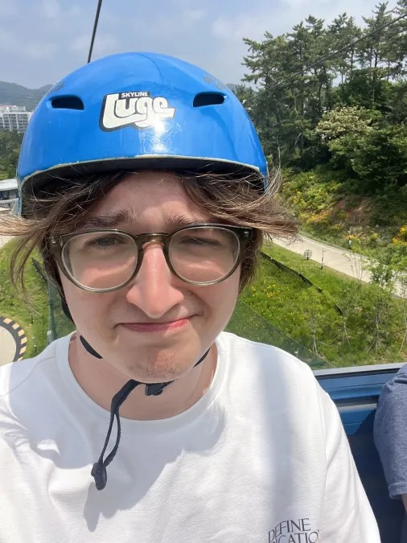

<html>
<head>
  <title>Noah's Page!</title>
</head>
<body>
  <h1>Noah's Page!</h1>
  
  
<small>This image is of me when I went to a trip to South Korea.</small>

  <!-- bio -->
  <h2>Bio</h2>
  
I am a student of Michigan State University(MSU) studying how to become a modeler and animator so that onde day I can be a part of the game making process. I've always both admired and loved games since I can remember. This would explain why I want to be a part of this process.

  <!-- special topic -->
  <h2>My Favorite Video Games OAT</h2>
  
To start, <b>THIS IS MY OPNINION</b> (LOL)! I'm sure my favorite games will change in the future as I constantly seem to have different favorites based on how recently I played each. That said, I do not neccessarily have much nostalgia when it comes to games. This is because I know that newer games tend to iterate upon past games. An example of this is Palworld having the Pokemon mechanics while also introducing a plethora of modern game mechanics. But, with that said, some games from the past really are great or have some things that grealty set them apart from other games. This would be something like Plants vs Zombies having a near perfect formula while also having a very hard time replicating what makes it so great without making a new game and it bringing in new concepts that ruin the game.

  <!-- the games -->
  <h3>The Games</h3>
  <ol>
    <li>Sekiro: Shadows Die Twice</li>
    <li>Abiotic Factor</li>
    <li>Baldur's Gate III</li>
    <li>Return of the Obra Dinn</li>
    <li>Terraria</li>
  </ol>
  <!-- Reasoning -->
  <h3>Reasoning</h3>
  
Let's start at the bottom, number five. Terraria is a very fun game which has continuously been updated over the years with each update bringing large content updates spicing up the game to a pretty decent degree. It is a very easily replayable game and is fun for both sanbox builders and pve focused players. Terraria also is kepy alive with its modding community providing insane amounts of new and refreshing content to the game sometimes making the game feel entirely different from its original make.

  
At four is Return of the Obra Dinn. This game was created by the same developer(s?) of Papers Please which is pretty obvious when compared as Return of the Obra Dinn as a similar art style.

</body>
</html>
